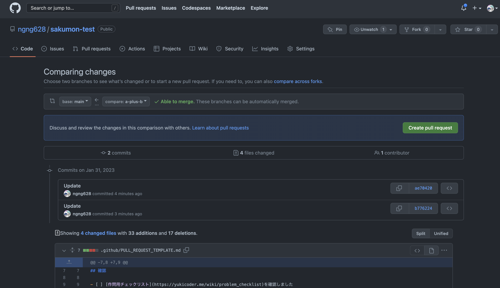
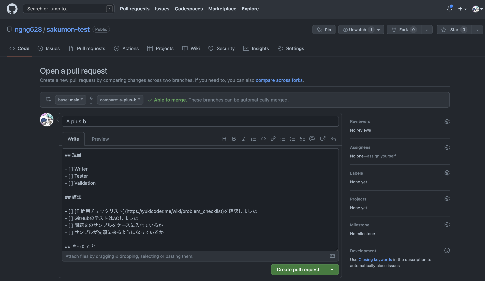
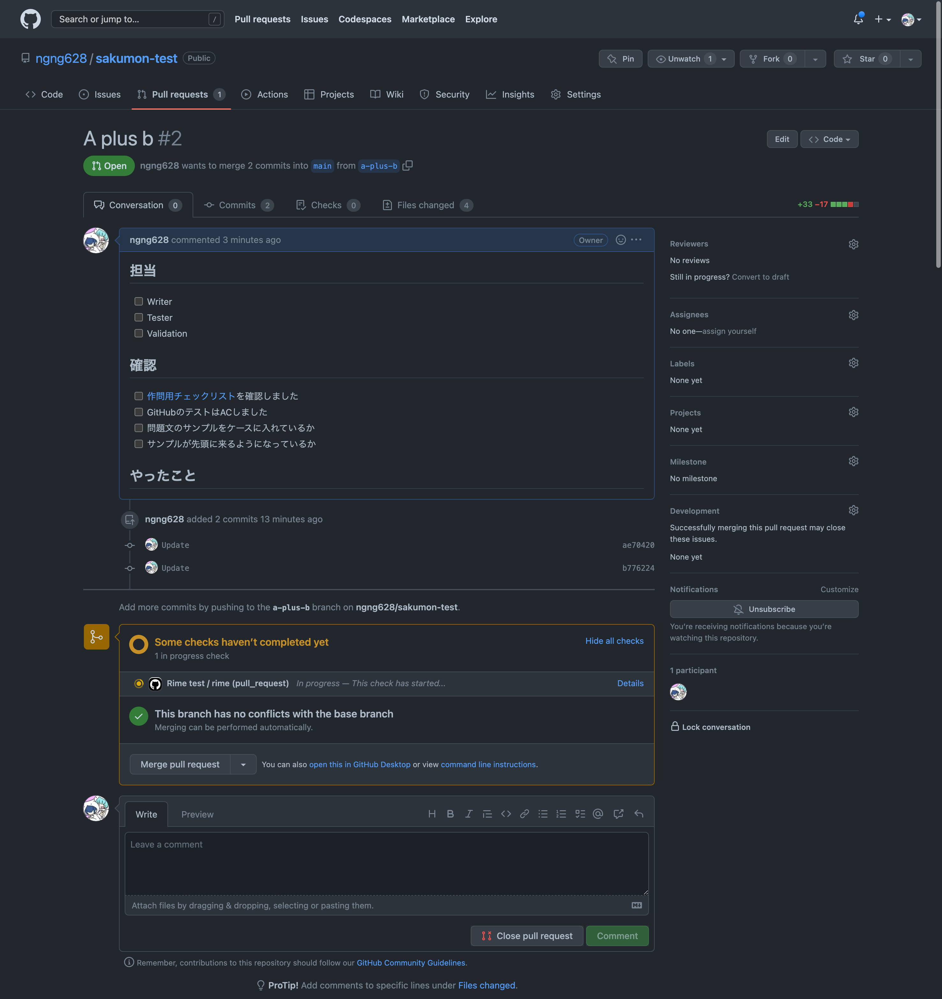

# Git/GitHubの使い方

## はじめに

Gitの使い方について、なるべく初心者向けに説明した記事です。


## 前提知識

Gitの概要は知っていてください。

 - git は履歴を管理するためのツール
 - GitHub は git で管理しているリポジトリをネット上で共有・管理するサイト
 - Git のブランチについての基本的な知識（ブランチとは何者か程度）


## リポジトリのクローン

```sh
$ git clone <URL>
```

`<URL>` で指定したリポジトリを自分のローカル環境にクローンします。

つまり、コマンドを打った場所に作問用ディレクトリが生成されます。

## ブランチの構成

ブランチは次の形で運用します。

|ブランチ名|概要|
|:--:|:--|
|`main`|全ての作問内容がマージされたブランチ|
|`hot-fix`|問題用ブランチですることでもない内容。`main` 直Pushは怖いので…|
|`a`|A問題のブランチ。実際には具体的な問題名が入ります|
|`b`|B問題のブランチ。実際には具体的な問題名が入ります|

[SHOULD] ブランチ名は小文字ハイフン区切りで作成してください（ `a-plus-b` など）

## 作業の仕方

あなたはA問題 "A Plus B" のTester（AC解の作成・嘘解法の作成・テストケースの作成・バリデーションの作成）になったと仮定します。

まず、自分の作業用ブランチに移動します。ブランチが存在しない場合は `git checkout -b a-plus-b` などで新規作成してください。

```sh
# ブランチ a-plus-b に移動
$ git checkout a-plus-b

# a-plus-b にいることを確認
$ git branch
```

Rimeの使い方を参考に `rime add . problem <problem_dir_name>` などの作業をしてください。

一通りの作業が終わったら GitHub にプッシュ（アップロード）します。まず、

```sh
$ git status
```

で変なファイルが対象になっていないかを確認します。自分の意図するファイルのみが表示されていればOKです。

```sh
$ git add .
$ git commit -m "Writer作業分を追加"
```

で全ての変更を Git に登録します。

```sh
$ git push origin 
```

で変更をGitHubにアップロードします。

[SHOULD] Pushしたあとはすぐさまプルリクエストを作成してください。作業の進捗が確認しやすくなります。

> **Note**
> プルリクエストを出しただけではマージされないので安心してください。

## GitHubでプルリクエストを作成する。

Pull requests =>　New pull request でプルリクエスト作成できます。

プルリクエストとは「このブランチをマージしたいんやけど、ええかいな？」というリクエストのことです。



Create pull request をクリックします。



プルリクのテンプレートが展開されます。
書きたいことがなければ Create pull request をクリックします。



作成すると自動テストが走り始めます。

もし、テストに失敗するとエラーだと怒られます。

成功すればOKです。Merge pull request を押してマージを完了しましょう。

## マージする

責任者がGitHub上でマージをします。

マージされた後、GitHub Actions でテストが走るので成功するかを見守ります。
失敗した場合は修正しましょう。

## GitHubとローカル環境を同期する。

他の人もGitHub上で作業するので、適当なタイミングでプル（同期）する必要があります。

```sh
$ git checkout <同期したいリポジトリ名>
$ git pull <同期したいリポジトリ名>
```

だいたいは怒られずに成功しますが、コンフリクトなどをしてしまう場合もあります。困ってしまった場合はGitに詳しい人に聞くのが良いです。
プルする前にコミットなどをしてしまうと面倒なことになりがちです。

## ローカル環境に他の人の作業内容を取り込む

`pull` は予め行っておいてください。

```sh
$ git checkout a-plus-b-ngng628  # 自分の作業ブランチに移動
$ git merge a-plus-b  # 親ブランチの内容を作業ブランチに統合
```
